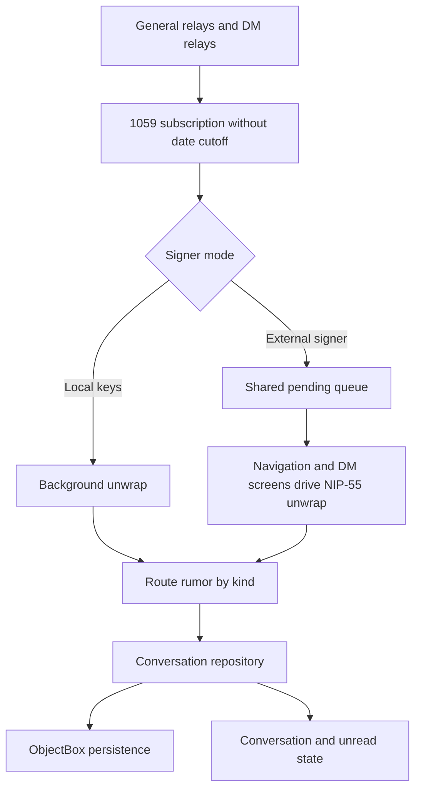

# What Goop can learn from Dark Wisp’s NIP-17 messaging

Dark Wisp provides useful examples of local conversation persistence, external-signer coordination, and visible relay information. It does not reveal a fundamentally different DM protocol or a history-fetching algorithm that we should substitute for Goop’s recent work. The strongest next steps for Goop are reliable delivery accounting, a responsive decryption scheduler, and clearer separation between downloaded messages, decrypted messages, and relay availability.

This review compares Dark Wisp commit `dcd8eb7e015fd5bb62b32df45b76a7ffbfea5175` with Goop commit `aacaca484f3ad8361c599c10df978811025de9ad`. It is a source-level review conducted on September 14, 2026, not a measured Android-versus-desktop performance comparison. The recommendations preserve Goop’s agreed scope: NIP-17, external identity signers, and history from the user’s current inbox relays. No NIP-04 or additional history-relay feature is proposed. Sources below pin application code to the reviewed revisions; protocol documents are living specifications accessed on the review date.

## How Dark Wisp receives and reconstructs chats

On startup, Dark Wisp subscribes to kind `1059` events tagged for the logged-in public key. Its `dms` filter has neither `since` nor `limit`. It sends that request to its general relay collection and its dedicated DM relays. The comment beside the filter explicitly identifies randomized wrapper timestamps as the reason to avoid a date cutoff. The same subscription is restored during lifecycle recovery. This gives a simple explanation for why old chats can appear readily: any retained wraps returned by those relays are eligible immediately.[^1]

That is not unlimited history retrieval. Relays can impose their own result limits. The reviewed subscription does not page backwards after EOSE, and EOSE means the current query’s stored results have ended, not that every historical message has been recovered. Dark Wisp’s wider receive destinations may also recover copies that would not be found on a user’s current inbox relays alone. We should not reproduce that broader routing as a workaround for Goop’s deliberate history scope.[^1]

Dark Wisp’s relay pool tracks active subscriptions per relay and resends them on reconnect. Its startup coordinator also resends the DM request after an authentication-completion signal. This matters because an open WebSocket does not imply permission to read private messages. However, the signal is emitted after sending the AUTH event, before a positive relay acknowledgement is established by that path. The intent is useful; the completion semantics need stronger guarantees if implemented in Goop.[^2]

The receive pipeline branches according to signer type. With local identity keys, `DmListViewModel` unwraps incoming events on a background dispatcher. With an external signer, it puts the raw gift wrap in a shared pending queue. The navigation layer observes the pending count and available signer to drain this queue in the background; entering the DM list or a conversation also triggers a drain. Both view models expose pending/decrypting state through the repository. Opening a DM screen is therefore not required for external-signer decryption.[^3]

The repository identifies a conversation using the sorted, unique participant public keys joined into a stable string. Messages retain both gift-wrap and rumor identifiers, their actual message timestamp, participants, relay provenance, reply relationships, reactions, and optional encrypted-file metadata. Sorting uses the inner message timestamp. This is a useful model to study because transport, conversation identity, and presentation have explicit representations.[^4]

There is a distinction worth preserving: Dark Wisp has a rumor-ID index, but `addMessage` rejects duplicates by gift-wrap ID. The index supports finding messages for other operations; it does not itself prevent two different wraps containing the same rumor from being inserted. A robust Goop model should deduplicate transport by wrapper ID and displayed messages by validated rumor ID, with both scoped to the account.[^4]

## Persistence and why returning to a chat feels fast

`DmPersistence` stores decrypted messages in ObjectBox, indexed by owner and conversation, with a unique owner-plus-gift-wrap key. Startup seeds the in-memory repository from disk, including its seen-wrapper index. A previously decrypted wrap can therefore be recognized before asking the external signer to decrypt it again. This is particularly valuable when each unwrap requires two separate signer operations.[^5]

Writes are buffered: the worker drains queued messages, usually waits 200 milliseconds for more, then performs a bulk put. This reduces write overhead during a burst. It is not a durable ingest queue: `queueMessage` uses `trySend` without checking the result, write errors are logged and the batch cleared, and queued work is not shown to be flushed transactionally during account removal. Those are reasons to borrow the data model rather than copy the write-behind mechanics unchanged.[^5]

The persisted fields contain decrypted content and file decryption metadata. This application-layer representation is not encrypted by the serialization code examined here. That observation is narrower than a complete assessment of Android storage protection. Logout/account clearing also deletes the prior account’s messages through the repository’s clear path. Goop should choose and document its own cache lifecycle explicitly instead of inheriting those semantics accidentally.[^4][^5]

Goop already has the essential optimization: `extract_rumor` checks the local cache before invoking the signer. Its history loader persists ciphertext before queueing decryption and advancing a checkpoint. The meaningful next improvement is a coherent account-scoped message/job index, not simply “add caching.” Such an index could distinguish stored ciphertext, pending work, verified plaintext, and permanent protocol rejection without replaying every cached wrapper through the same scheduling path on each refresh.[^6][^7]

## External signers are not equivalent performance environments

Dark Wisp’s `RemoteSigner` means an Android NIP-55 signer, such as Amber. It first tries a ContentResolver operation, then falls back to a signer activity if necessary. The activity bridge serializes interactive requests with a mutex. After acquiring that mutex, encryption/decryption operations retry the silent path because an earlier interaction may have granted permission. That avoids unnecessary repeated prompts.[^8]

Goop’s bunker path involves NIP-46 RPC rather than Android IPC. We cannot infer that Goop should decrypt at Dark Wisp’s local-key speed, or that serializing every bunker request will improve throughput. The transferable principle is to coordinate signer work centrally and distinguish interactive approval, transport unavailability, and valid operation results.

Today Goop runs four unwrap jobs concurrently, each with a 30-second timeout and one automatic retry after two seconds. Historical and live messages share a bounded FIFO queue. That bounds work, but it allows an old-message backlog to delay a newly arriving message. A failed inner decryption also restarts the whole unwrap on retry, including the outer operation.[^9]

A better scheduler would reserve capacity for live arrivals and explicit user operations, keep historical work progressing at a lower priority, and pause automatic retries for explicit signer rejection. It should report “waiting for signer” separately from “fetching history.” Before the outer layer is decrypted, the application does not know the real sender, so it cannot reliably prioritize arbitrary encrypted history by chat partner. Priority should initially use information actually available: live versus backfill origin, already-known local mappings, and explicit retries.

Dark Wisp’s error handling is a caution here. The pending queue removes a wrap before attempting decryption. The unwrap helpers catch exceptions and return null, while the screen-level drains also skip failures. In the reviewed paths, those failures are not requeued or recorded as durable failed jobs. Goop’s retained ciphertext and explicit retry controls already offer a stronger recovery foundation.[^3][^9][^10]

## Relay discovery, authentication, and delivery

Dark Wisp queries kind `10050` for a peer’s DM relays through indexers and its connected relay collection. The lookup takes the newest response received during a four-second window and caches nonempty results. The cache has an entry limit but no expiry in the DM repository. The lookup also starts its response collector after sending requests, which creates a potential fast-response race depending on event buffering.[^11]

For sending, the conversation view model falls back from the recipient’s DM relays to their kind `10002` read relays, then write relays, and finally the sender’s write relays. That may explain some apparent reachability benefits, but it is not a strategy to import into Goop. Current NIP-17 directs publication to the recipient’s advertised kind `10050` relays and treats an absent list as the recipient not being ready for NIP-17. Profile outbox discovery and DM inbox discovery need distinct policies.[^12][^13]

The useful UI idea is that Dark Wisp exposes the peer’s delivery relay list and its source, the user’s own DM relays, and per-participant relay information for group chats. Goop can offer a compact connection panel showing current inbox destinations, connection/authentication state, the latest completed query, and failures. This should describe actual state rather than present general network connectivity as proof that messaging works.[^12]

Dark Wisp makes separate wraps for each participant and the sender. Its text-message path fixes the inner timestamp before producing the wraps and keeps the inner tags consistent so every recipient gets the same rumor ID. Its outer encryption uses a fresh local throwaway key even when the identity signer is external. That does not require importing the user’s private identity key.[^10][^12]

The delivery helper returns the relay URLs for which `sendToRelayOrEphemeral` returned true. That method can return true after handing the message to an existing connection or queue; it does not await an `OK` acceptance response. Although the relay pool publishes acknowledgement events elsewhere, this DM send path does not use them to decide success. The text “no relays accepted” therefore promises more than the helper actually measures.[^12][^14]

Goop also needs work in this area. Its send helper deliberately uses `AckPolicy::none()`, while a UI listener separately processes relay `OK` messages. The wrapper IDs tracked by that listener are added only after the room send task has completed. An acknowledgement received earlier is ignored because its ID is not yet in `sent_ids`. Reports are also installed after publishing, leaving another timing window. This is a concrete race visible in the code, though it has not been reproduced in an integration test during this review.[^15]

The fix should prepare and register every wrap and its destination state before publication, or move acknowledgement ownership into a send service that retains early responses. Persist the prepared wraps for retry. Use distinct states for prepared, queued, accepted by at least one destination, rejected, and timed out. “Accepted by a relay” must remain distinct from “read by the recipient.” Track each group participant and the sender copy independently so partial success is recoverable without creating another rumor.

Goop currently sends its self-copy only when backup is enabled and at least one recipient send returns successfully. That couples local-history recovery to recipient delivery and a legacy configuration concept. Making the self-copy an explicit part of the send transaction is worth reviewing, particularly for a user returning on another device.[^15]

## History: retain Goop’s newer design

Goop’s current loader already contains more history machinery than the Dark Wisp receive path: independent account/relay checkpoints, explicit EOSE handling, backwards pagination, an overlapping recent scan, bounded relay concurrency, ciphertext persistence before progress advancement, and recovery controls. Its default page size is 256, increasing up to 4096 when an entire boundary page shares a timestamp. The recent overlap is two days.[^7]

These mechanisms should be retained and tested against difficult relay behavior. They address the main weakness of a single unrestricted subscription: a relay can return its newest capped results and stop. Repeating that same query may never reveal older results.

One remaining edge case deserves a dedicated test. Goop detects a full timestamp boundary by comparing the response count with the requested limit. If a server silently imposes a smaller cap and many wraps share a timestamp, a short response can look like a completed boundary even when more events remain. Timestamp-only pagination cannot guarantee recovery of every tied event from every capped relay. The UI should not claim complete account history merely because the available queries are exhausted.[^7]

Similarly, checkpoints should follow the current inbox-list revision. If relay configuration changes during an active scan, the system should schedule the newly selected relays after the current generation or restart safely. Authentication failure, an incomplete page, and a genuinely empty completed query need separate outcomes. These are targeted extensions of the existing architecture rather than reasons to replace it.

For a user, “received 1,000 wraps” is different from “loaded 1,000 messages”: some wraps are duplicates, reactions, unsupported payloads, or waiting on a signer. Keep those counters distinct and make completion local to a particular relay scan. No client can retrieve messages that the selected relays no longer retain.

## Validation and interoperability findings

Dark Wisp checks the outer kind and the seal’s kind, then accepts a small set of inner kinds. However, the unwrap helpers parse the seal without calling its signature verifier and accept the rumor’s claimed author without checking equality with the seal author. `NostrEvent.fromJson` is deserialization, not verification. The relay pool verifies the outer event, but an outer signature does not authenticate the encrypted sender.[^10][^14][^16]

This is a code-level validation gap, not an exploit demonstration or a complete security audit. The appropriate lesson is to retain Goop’s seal verification and explicit author-match check. These should not be removed while borrowing other parts of the pipeline.[^6]

Goop still needs explicit protocol-boundary tests. Its custom unwrap path does not explicitly enforce seal kind 13. `ensure_id` supplies a missing rumor ID but does not validate a supplied one; the SDK has a separate `verify_id` operation. Its cache writer also labels every cached rumor with a `k=14` application tag, including non-chat kinds, which makes storage routing less precise than the underlying data. The cache lookup uses a bare identifier filter rather than explicit account, local author, and application-kind constraints.[^6][^17]

Recommended tests should cover wrong seal kind, invalid seal signature, a mismatched author, an incorrect supplied rumor ID, unsupported rumor kinds, account isolation, and a reaction that must not create a chat entry. Envelope validation should be separate from dispatching text, reactions, and files. NIP-59 describes the wrapping layers; accepting a structurally valid wrapper does not mean every inner event belongs in the DM timeline.[^18]

Dark Wisp randomizes seal and wrap timestamps over approximately one day, with a comment citing interoperability with clients using tighter receive filters. Goop should keep its receive overlap tolerant rather than shorten it based on that single implementation choice. This review does not establish which timestamp policy performs best across deployed clients.[^10]

Dark Wisp also implements encrypted kind-15 file messages, including file-key metadata stored inside the encrypted conversation payload. That is a useful later feature reference. It should be reviewed separately for group recipient-tag consistency: the file-send path does not visibly add the extra group participant tags used by the text-send path. Do not treat text and attachment interoperability as already equivalent.[^12]

## Profiles and missing avatars are a separate pipeline

Dark Wisp batches missing-profile requests, tracks pending/in-flight attempts, uses outbox routing initially, and allows bounded retries and relay hints. Its application has a shared Coil image loader with an explicit memory cache. These are useful examples of centralizing requests and image loading, but they do not establish that a missing avatar is caused by a DM relay problem.[^19]

Goop already performs author outbox discovery for profiles, retains a fallback for authors without a known outbox, and has a test covering that distinction. Its shared avatar cache addresses repeated image downloads and stale view-local failures. The next useful diagnostic should separate “no kind-0 metadata found,” “picture URL known but image request failed,” and “image cached but view not updated.” Adding more DM relays cannot fix the latter two states.[^20]

For heavy history loading, profile fetches should prioritize visible chat participants and coalesce duplicate requests. A disk image cache may improve warm starts, but it is independent of message persistence and should be justified by measured request volume and startup behavior.

## Recommended implementation sequence

| Priority | Change | Benefit | Relative effort | Acceptance evidence |
|---|---|---|---|---|
| 1 | Register send state before publishing; retain prepared wraps and track per-destination acknowledgements | Removes a concrete status race and makes partial delivery retryable | Medium | A relay that acknowledges immediately is recorded; retry reuses the same rumor and wrap IDs |
| 1 | Validate envelope and rumor boundaries; constrain account-scoped cache queries | Prevents malformed or misrouted records entering the conversation model | Small–medium | Negative protocol fixtures and cross-account cache tests |
| 1 | Test AUTH-required inbox retrieval through rejection, authentication, and resubscription | Addresses “connected but no messages” failures | Medium | A protected mock relay eventually yields history, or exposes a specific actionable failure |
| 2 | Prioritize live decryption and classify signer failures | Keeps new chats responsive while history loads | Medium | A live wrap completes during a large backfill; denied signing does not loop |
| 2 | Add account-scoped job/message indexes and reliable state transitions | Faster warm starts and predictable crash recovery | Larger | Restart at each ingest stage loses no ciphertext and avoids needless repeat signer work |
| 2 | Expose per-chat/current-inbox relay diagnostics | Makes relay, signer, and image issues distinguishable | Small–medium | UI reflects real connection, AUTH, query and publish outcomes |
| 2 | Extend pagination and relay-list-change tests | Protects the history work already implemented | Medium | Lower server caps, timestamp ties, disconnects, and list changes are handled honestly |
| 3 | Improve profile scheduling and evaluate disk avatar caching | Reduces history-driven metadata bursts and repeat image loads | Medium | Measured request reduction and consistent avatars across views |
| 3 | Review encrypted-file interoperability | Adds a useful DM capability after reliability work | Larger | Cross-client text, file, reply, reaction, and group fixtures |

Effort estimates are relative engineering judgments, not calendar commitments. The first implementation should combine a failing fast-acknowledgement test with the send-state fix. In parallel conceptually, but not dependent on it, add negative unwrap fixtures before changing cache or scheduler structure. Avoid a broad repository rewrite until these tests establish current behavior.

A realistic validation harness should use controlled relays and a fake external signer with configurable latency, rejection, and disconnection. Measure time to the first cached conversation, first new decrypted message, live-message delay during backfill, repeated signer calls after restart, and acknowledged sends. Android and Goop should only be compared quantitatively using equivalent retained event sets and signer conditions.

The reviewed Dark Wisp test tree contains event-ID and other application tests, but no dedicated NIP-17 DM suite was found by filename inspection. Neither its Android build nor live-device interoperability tests were run for this report. Assertions about code paths are high confidence where directly cited; performance explanations, deployed relay behavior, and proposed failure scenarios remain hypotheses until exercised.

## Sources

[^1]: [Dark Wisp: startup DM subscription](https://github.com/barrydeen/dark-wisp-android/blob/dcd8eb7e015fd5bb62b32df45b76a7ffbfea5175/app/src/main/kotlin/com/darkwisp/app/viewmodel/StartupCoordinator.kt#L940-L952).

[^2]: [Dark Wisp: AUTH and reconnect handling](https://github.com/barrydeen/dark-wisp-android/blob/dcd8eb7e015fd5bb62b32df45b76a7ffbfea5175/app/src/main/kotlin/com/darkwisp/app/relay/RelayPool.kt#L539-L611); [post-AUTH subscription](https://github.com/barrydeen/dark-wisp-android/blob/dcd8eb7e015fd5bb62b32df45b76a7ffbfea5175/app/src/main/kotlin/com/darkwisp/app/viewmodel/StartupCoordinator.kt#L555-L570); [subscription restoration](https://github.com/barrydeen/dark-wisp-android/blob/dcd8eb7e015fd5bb62b32df45b76a7ffbfea5175/app/src/main/kotlin/com/darkwisp/app/relay/RelayPool.kt#L1105-L1128).

[^3]: [Dark Wisp: receive and external-signer queue drain](https://github.com/barrydeen/dark-wisp-android/blob/dcd8eb7e015fd5bb62b32df45b76a7ffbfea5175/app/src/main/kotlin/com/darkwisp/app/viewmodel/DmListViewModel.kt); [background drain trigger](https://github.com/barrydeen/dark-wisp-android/blob/dcd8eb7e015fd5bb62b32df45b76a7ffbfea5175/app/src/main/kotlin/com/darkwisp/app/Navigation.kt#L557-L565); [conversation drain](https://github.com/barrydeen/dark-wisp-android/blob/dcd8eb7e015fd5bb62b32df45b76a7ffbfea5175/app/src/main/kotlin/com/darkwisp/app/viewmodel/DmConversationViewModel.kt#L225-L297).

[^4]: [Dark Wisp: conversation repository, duplicate handling, and account clearing](https://github.com/barrydeen/dark-wisp-android/blob/dcd8eb7e015fd5bb62b32df45b76a7ffbfea5175/app/src/main/kotlin/com/darkwisp/app/repo/DmRepository.kt).

[^5]: [Dark Wisp: persistence implementation](https://github.com/barrydeen/dark-wisp-android/blob/dcd8eb7e015fd5bb62b32df45b76a7ffbfea5175/app/src/main/kotlin/com/darkwisp/app/db/DmPersistence.kt); [persisted message schema](https://github.com/barrydeen/dark-wisp-android/blob/dcd8eb7e015fd5bb62b32df45b76a7ffbfea5175/app/src/main/kotlin/com/darkwisp/app/db/DmMessageEntity.kt).

[^6]: [Goop: unwrap and plaintext cache](https://github.com/dergigi/goop/blob/aacaca484f3ad8361c599c10df978811025de9ad/crates/chat/src/lib.rs#L834-L921).

[^7]: [Goop: paginated history and checkpoint tests](https://github.com/dergigi/goop/blob/aacaca484f3ad8361c599c10df978811025de9ad/crates/chat/src/history.rs); [history orchestration and room loading](https://github.com/dergigi/goop/blob/aacaca484f3ad8361c599c10df978811025de9ad/crates/chat/src/lib.rs).

[^8]: [Dark Wisp: local and NIP-55 signers](https://github.com/barrydeen/dark-wisp-android/blob/dcd8eb7e015fd5bb62b32df45b76a7ffbfea5175/app/src/main/kotlin/com/darkwisp/app/nostr/NostrSigner.kt); [interactive signer bridge](https://github.com/barrydeen/dark-wisp-android/blob/dcd8eb7e015fd5bb62b32df45b76a7ffbfea5175/app/src/main/kotlin/com/darkwisp/app/nostr/SignerIntentBridge.kt).

[^9]: [Goop: bounded decryption queue, retries, and tests](https://github.com/dergigi/goop/blob/aacaca484f3ad8361c599c10df978811025de9ad/crates/chat/src/decryption.rs).

[^10]: [Dark Wisp: gift wrapping, unwrap validation, and timestamp policy](https://github.com/barrydeen/dark-wisp-android/blob/dcd8eb7e015fd5bb62b32df45b76a7ffbfea5175/app/src/main/kotlin/com/darkwisp/app/nostr/Nip17.kt).

[^11]: [Dark Wisp: DM relay lookup](https://github.com/barrydeen/dark-wisp-android/blob/dcd8eb7e015fd5bb62b32df45b76a7ffbfea5175/app/src/main/kotlin/com/darkwisp/app/repo/DmRelayLookup.kt); [NIP-65 relay lookup](https://github.com/barrydeen/dark-wisp-android/blob/dcd8eb7e015fd5bb62b32df45b76a7ffbfea5175/app/src/main/kotlin/com/darkwisp/app/repo/PeerRelayListLookup.kt); [DM relay cache](https://github.com/barrydeen/dark-wisp-android/blob/dcd8eb7e015fd5bb62b32df45b76a7ffbfea5175/app/src/main/kotlin/com/darkwisp/app/repo/DmRepository.kt).

[^12]: [Dark Wisp: relay resolution and text/file delivery](https://github.com/barrydeen/dark-wisp-android/blob/dcd8eb7e015fd5bb62b32df45b76a7ffbfea5175/app/src/main/kotlin/com/darkwisp/app/viewmodel/DmConversationViewModel.kt); [DM conversation UI](https://github.com/barrydeen/dark-wisp-android/blob/dcd8eb7e015fd5bb62b32df45b76a7ffbfea5175/app/src/main/kotlin/com/darkwisp/app/ui/screen/DmConversationScreen.kt).

[^13]: [NIP-17: private direct messages](https://github.com/nostr-protocol/nips/blob/master/17.md); [Goop’s pinned SDK: NIP-17 destination selection](https://github.com/rust-nostr/nostr/blob/472c8839ea3f532259435d0513bf155ddeb467ba/nostr-sdk/src/client/api/send_event.rs#L242-L314).

[^14]: [Dark Wisp: outer verification, publish results, and send queue semantics](https://github.com/barrydeen/dark-wisp-android/blob/dcd8eb7e015fd5bb62b32df45b76a7ffbfea5175/app/src/main/kotlin/com/darkwisp/app/relay/RelayPool.kt).

[^15]: [Goop: wrapping, recipient delivery, and self-copy](https://github.com/dergigi/goop/blob/aacaca484f3ad8361c599c10df978811025de9ad/crates/chat/src/room.rs#L530-L655); [acknowledgement listener](https://github.com/dergigi/goop/blob/aacaca484f3ad8361c599c10df978811025de9ad/crates/chat_ui/src/lib.rs#L231-L290); [registration after sending](https://github.com/dergigi/goop/blob/aacaca484f3ad8361c599c10df978811025de9ad/crates/chat_ui/src/lib.rs#L442-L505).

[^16]: [Dark Wisp: event parsing and signature verification are separate operations](https://github.com/barrydeen/dark-wisp-android/blob/dcd8eb7e015fd5bb62b32df45b76a7ffbfea5175/app/src/main/kotlin/com/darkwisp/app/nostr/Event.kt#L110-L182).

[^17]: [Pinned Rust Nostr SDK: ensure_id, compute_id, and verify_id](https://github.com/rust-nostr/nostr/blob/472c8839ea3f532259435d0513bf155ddeb467ba/nostr/src/event/unsigned.rs#L72-L117).

[^18]: [NIP-59: gift wrapping](https://github.com/nostr-protocol/nips/blob/master/59.md).

[^19]: [Dark Wisp: profile batching and retries](https://github.com/barrydeen/dark-wisp-android/blob/dcd8eb7e015fd5bb62b32df45b76a7ffbfea5175/app/src/main/kotlin/com/darkwisp/app/repo/MetadataFetcher.kt); [shared image loader](https://github.com/barrydeen/dark-wisp-android/blob/dcd8eb7e015fd5bb62b32df45b76a7ffbfea5175/app/src/main/kotlin/com/darkwisp/app/WispApp.kt#L80-L100).

[^20]: [Goop: profile discovery and outbox/fallback integration test](https://github.com/dergigi/goop/blob/aacaca484f3ad8361c599c10df978811025de9ad/crates/state/src/profiles.rs); [shared caching](https://github.com/dergigi/goop/blob/aacaca484f3ad8361c599c10df978811025de9ad/crates/common/src/caching.rs); [avatar rendering](https://github.com/dergigi/goop/blob/aacaca484f3ad8361c599c10df978811025de9ad/crates/ui/src/avatar.rs).
